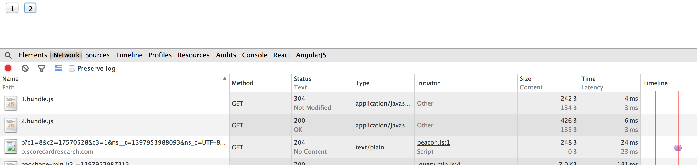

Requirejs was good, and still is, but as more time spend coding in the backend, the node require becomes a habit, and will start to get tired with AMD everytime you create a new file. 

Than came along browserify, a lot of developers have moved over to it. But browserify does not offer code spliting like reuqirejs does... as well as other little candies like css loader and so on. 

I don't want to load the whole app in just one big file, some one page application these days can go over 1mb for just the .js files. [Webpack](http://webpack.github.io) come to the rescue.

# Simple setup

### Setting up webpack

        npm install webpack -g

### create your js files

To begin the test, we just create a app.js file as entry point and another file to be included

        // app.js
        var test = require(['./test'])

        console.log(test)

heres the include file

        // test.js
        module.exports = "hey you got me"

Once u got these 2 files, you can run the webpack command to bundle it

        // the first argument is the entry script, the second argument is the output
        webpack ./app.js bundle.js

You just need to load the bundle.js into your html and you are good to go!

# What about code spliting and lazy loading??

lets say we have a index page with indexCtrl and conact page with contactCtrl, but I only want to load the contactCtrl when the user click on the menu from the indexPage

        // indexCtrl.js as the entry script
        // we will use jquery for the events
        
        $(document).on('click', '.open-about', function(){
            require('./aboutCtrl', function(about){
                about.init()
            })
        })

Now if you try to compile indexCtrl, webpack will split the files automatically for you.
you can now just load both jquery and your bundle.js file, and test it with the network panel on the click event. 

Nice huh, for my test, 2.bundle.js will only be loaded after the click event

# HM I don't wnat to bundle jQuery or something large that can be used on CDN!

Unfortunely at the time of writing this, webpack only works as a bundler, and does not take care of dependency loading on these external files, the best you can do is not to bundle it, but manullay use script tag to add jQuery before your bundle.js. Its best to use a webpack.config.js file so you don't have to type out the cmd evrytime you you compile. Webpack offers a dev watch server, but I use gulp, take a dig into the webpack documentation.

But YAH it gets annoying if you use multiple cdn stuff like, backbone, angular... What I do is used the jQuery promise to solve this issue, and load them, this is what i do

        // index.html
        
        
        

And if any of your module requires a backbone plugin like pagination, I'll lazy load them

        // someModule.js
        require(['backbone.paginiation'])

than I begin to work with the pagination plugin, some people use those smaller plugins off the CDN, but I like to bundle everything that is not over 100kb

# Wrap up

Go dig into their documentations, they offer css compiling into a js file, so your whole app won't even required to manually load the link tags for css, and other goodies.

Me personally, I won't bundle the css unless either your app is really small or really big, if its really small, just load everything in one js file, won't hurt your loading. If it is too big, I'll link the base-styles...css and lazy load any other component based css

